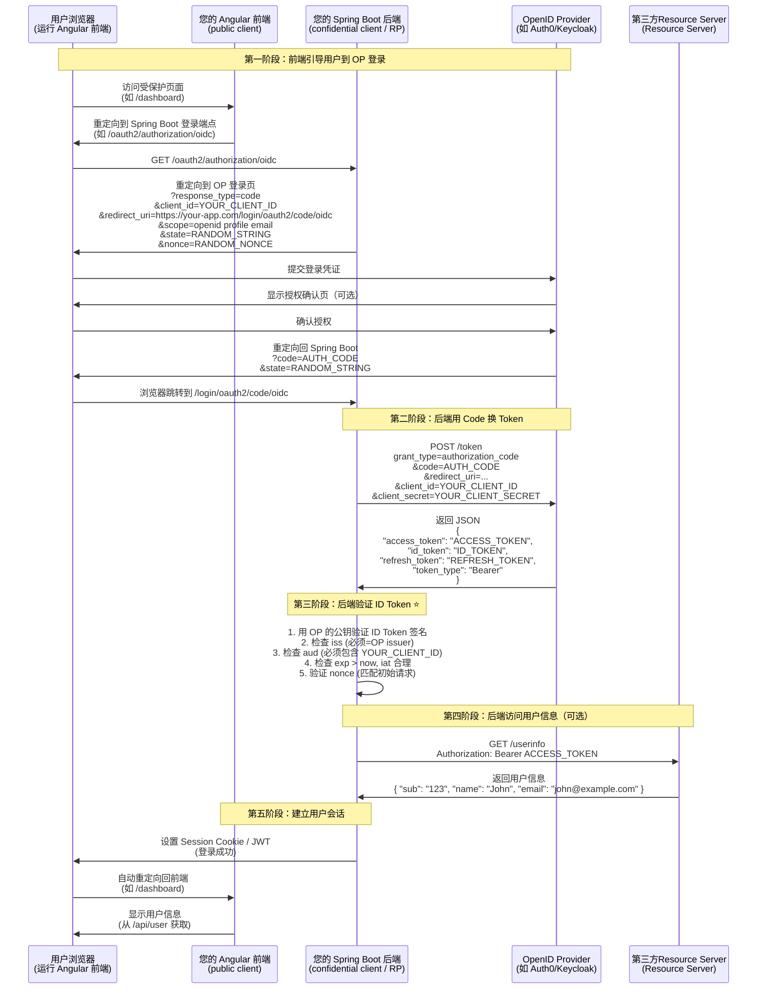

当然可以！下面是对您提供的 OIDC **Authorization Code Flow** 流程图的**精细化标注**，明确标识：

- ✅ **您的 Angular 前端应用**
- ✅ **您的 Spring Boot 后端应用**
- ✅ **ID Token 验证责任方**
- ✅ **各组件在 OIDC 中的角色**

---

## 🧩 角色映射说明

| Mermaid 中的名称 | 实际对应                                 | 说明 |
|------------------|--------------------------------------|------|
| **`User`** | 用户浏览器                                | 最终用户操作的浏览器 |
| **`Client (RP)`** | **您的 Spring Boot 后端**                | 在标准 OIDC 中，**“客户端”指能安全存储 `client_secret` 的服务端应用** |
| **`OP`** | 身份提供商（如 Auth0 / Keycloak / Azure AD） | 第三方认证服务 |
| **`Resource`** | ** 第三方Resource Server **（或独立用户信息服务）  | 提供 `/userinfo` 或业务 API 的服务 |

> 💡 **关键认知**：  
> **在标准 Authorization Code Flow 中，Angular 前端只是“用户代理”，真正的 OIDC 客户端是 Spring Boot 后端！**

---

## 🖼️ 精细化 Mermaid 图（含 Angular + Spring Boot 标注）



---

## 🔍 关键问题解答

### ❓ 1. **我的 Angular 前端在哪里？**
- **角色**：纯前端 UI，**不直接参与 OIDC 流程**
- **职责**：
    - 检测未登录状态 → 跳转到 Spring Boot 的 `/oauth2/authorization/oidc`
    - 登录成功后 → 我的 Spring Boot → 第三方 Resource Server 获取用户信息（通过 `/api/user`）

### ❓ 2. **我的 Spring Boot 后端在哪里？**
- **OIDC 客户端 (RP)**：处理 `/oauth2/authorization/oidc` 和 `/login/oauth2/code/oidc`

### ❓ 3. **谁验证 ID Token？**
- ✅ **您的 Spring Boot 后端**
    - 使用 Spring Security OAuth2 Client 自动验证
    - 验证内容：
        - **签名**：用 OP 的 JWKS 公钥（通过 `.well-known/jwks.json` 获取）
        - **iss**：必须等于 OP 的 issuer（如 `https://your-domain.auth0.com/`）
        - **aud**：必须包含您的 `client_id`
        - **exp/iat**：时间有效性
        - **nonce**：防重放攻击（必须匹配初始请求）

### ❓ 4. **为什么不是 Angular 验证 ID Token？**
- **安全原因**：
    - Angular 运行在浏览器，无法安全存储 `client_secret`
    - 如果让前端验证 ID Token，攻击者可伪造 Token 绕过认证
- **最佳实践**：
    - **认证由后端完成** → 前端只消费会话（Cookie/JWT）

---

## 🛠️ Spring Boot 配置示例（自动验证 ID Token）

```yaml
# application.yml
spring:
  security:
    oauth2:
      client:
        registration:
          oidc:
            client-id: YOUR_CLIENT_ID
            client-secret: YOUR_CLIENT_SECRET
            scope: openid,profile,email
        provider:
          oidc:
            issuer-uri: https://your-oidc-provider/.well-known/openid-configuration
```

> ✅ **Spring Security 会自动**：
> 1. 发现 OP 配置（通过 `issuer-uri`）
> 2. 获取 JWKS 公钥
> 3. 验证 ID Token 签名和声明
> 4. 创建 `OAuth2User` 对象

---

## 📌 总结：责任划分

| 组件 | 责任 |
|------|------|
| **Angular 前端** | UI 展示、跳转登录、调用后端 API |
| **Spring Boot 后端** | **OIDC 客户端 + ID Token 验证** |
| **OP (Auth0/Keycloak)** | 用户认证、签发 ID Token/Access Token |
| **用户浏览器** | 传递重定向、存储 Cookie |

> 💡 **记住**：  
> **在标准 Web 应用中，OIDC 的“客户端”永远是后端服务，前端只是用户操作的载体。**  
> 这是保证安全的核心设计！

此细化图可直接用于您的系统架构文档或安全审计！ 🔐