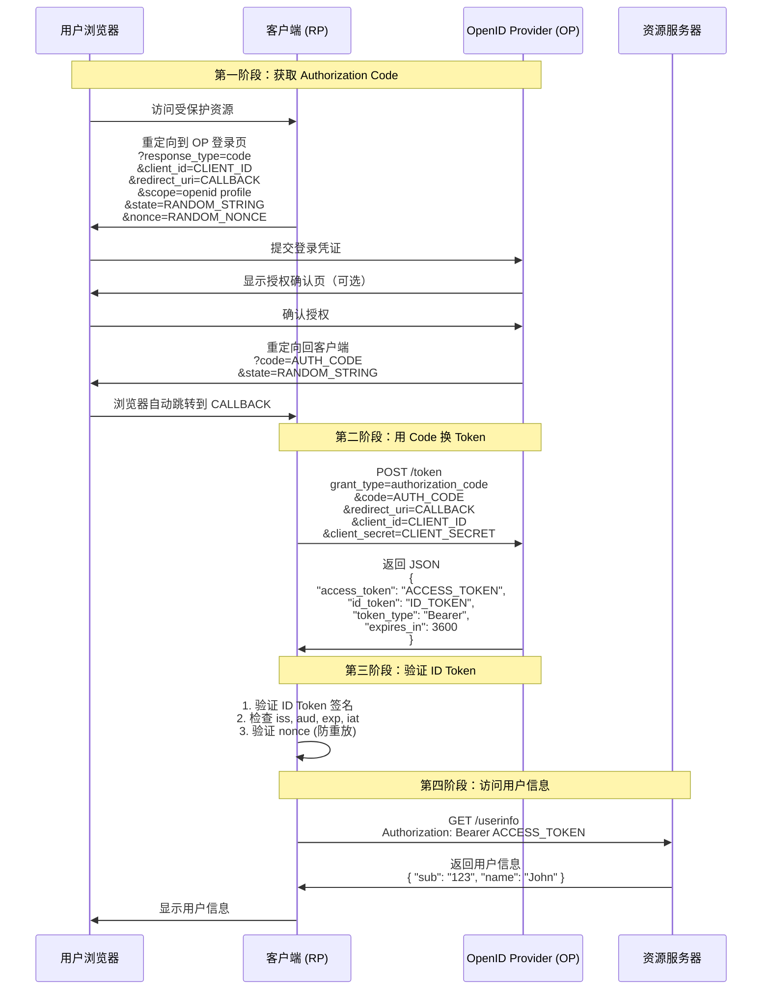
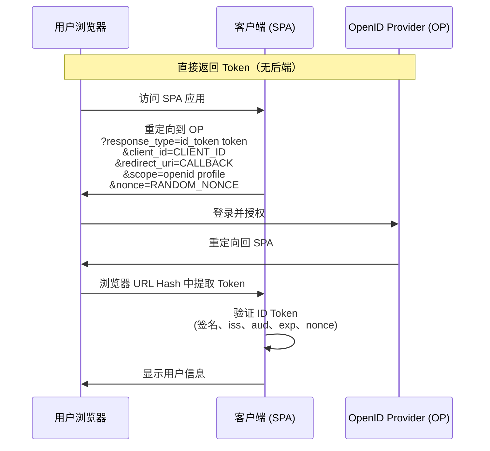
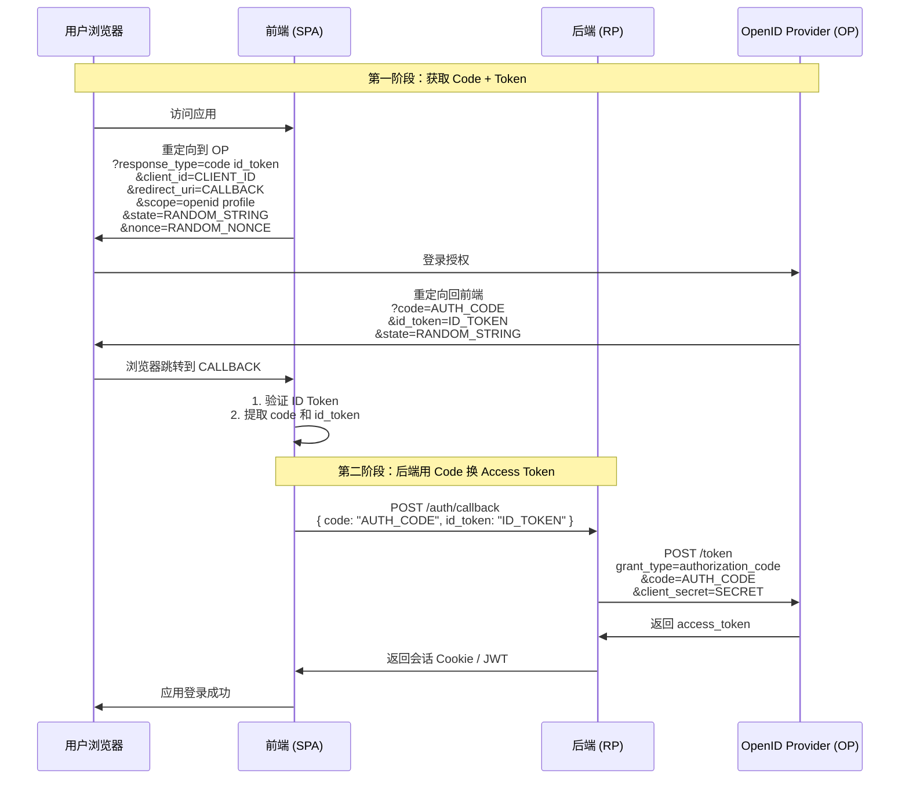
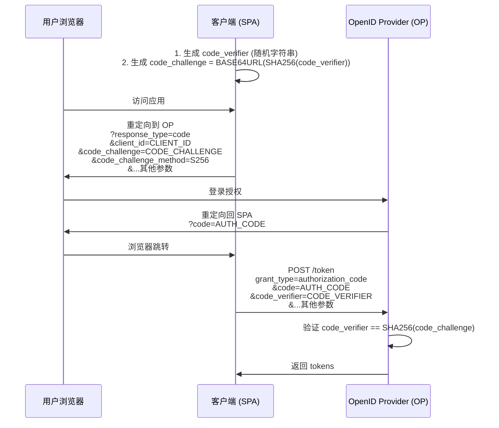

以下是 **OIDC（OpenID Connect）所有核心流程** 的详细 Mermaid 图解，涵盖 **认证码模式（Authorization Code Flow）**、**隐式模式（Implicit Flow）**、**混合模式（Hybrid Flow）** 三大标准流程，并标注关键安全机制。

---

## 🌐 1. **认证码模式（Authorization Code Flow）**
> **✅ 最安全、最推荐**（适用于 Web 应用、有后端的应用）

> 🔒 **关键安全机制**：
> - `state`：防 CSRF
> - `nonce`：防 ID Token 重放
> - `client_secret`：后端验证客户端身份
> - PKCE（未图示）：用于公共客户端（如 SPA）

---

## 📱 2. **隐式模式（Implicit Flow）**
> **⚠️ 已弃用**（OAuth 2.1 / OIDC 1.0 不推荐，仅用于遗留系统）

> ⚠️ **为什么弃用**？
> - Token 暴露在 URL（浏览器历史、日志）
> - 无 `client_secret`（无法验证客户端）
> - 无法使用 Refresh Token

---

## ⚡ 3. **混合模式（Hybrid Flow）**
> **适用于需要前端+后端协同的场景**（如 Angular + Node.js）

> ✅ **优势**：
> - 前端立即获得 ID Token（快速显示用户信息）
> - 后端安全获取 Access Token（用于调用 API）
> - 符合安全最佳实践

---

## 🔑 4. **PKCE 扩展（用于公共客户端）**
> **解决 SPA 无法安全存储 client_secret 的问题**

> ✅ **PKCE 是现代 SPA 的必备安全措施**（RFC 7636）

---

## 📊 流程对比表

| 流程 | 适用场景 | 安全性 | 是否推荐 |
|------|----------|--------|----------|
| **认证码 + PKCE** | SPA、移动 App | ⭐⭐⭐⭐⭐ | ✅ **强烈推荐** |
| **认证码（传统）** | Web 应用（有后端） | ⭐⭐⭐⭐ | ✅ 推荐 |
| **混合模式** | 前后端分离应用 | ⭐⭐⭐⭐ | ✅ 可选 |
| **隐式模式** | 遗留 SPA | ⭐ | ❌ **已弃用** |

---

## 💡 关键概念说明

- **RP (Relying Party)**：OIDC 客户端（你的应用）
- **OP (OpenID Provider)**：身份提供商（如 Auth0、Google）
- **ID Token**：JWT 格式，包含用户身份信息（`sub`, `name`, `email`）
- **Access Token**：用于访问 UserInfo Endpoint 或 API
- **nonce**：随机字符串，绑定认证请求与 ID Token，防重放攻击
- **state**：随机字符串，防 CSRF 攻击

---

> 📌 **最佳实践**：  
> **所有新项目应使用 `Authorization Code Flow + PKCE`**，这是 OAuth 2.1 和 OIDC 的现代标准。

这些流程图覆盖了 OIDC 所有官方支持的认证模式，可直接用于系统设计或安全审计！ 🔐